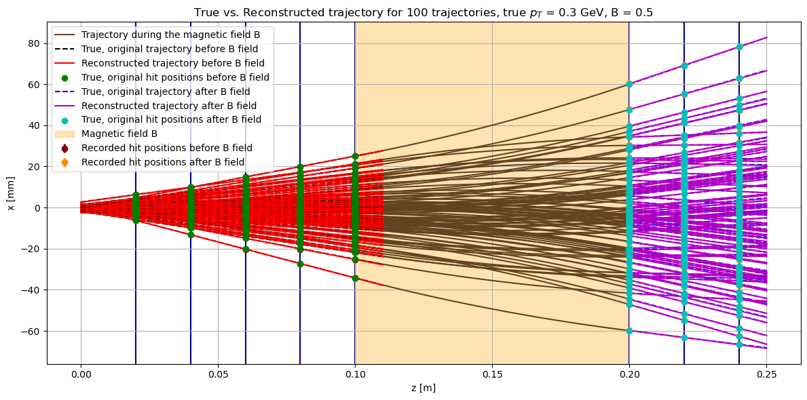
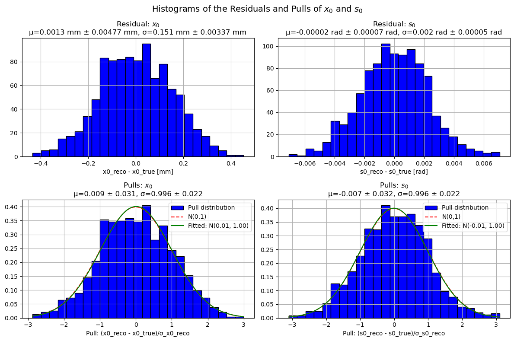
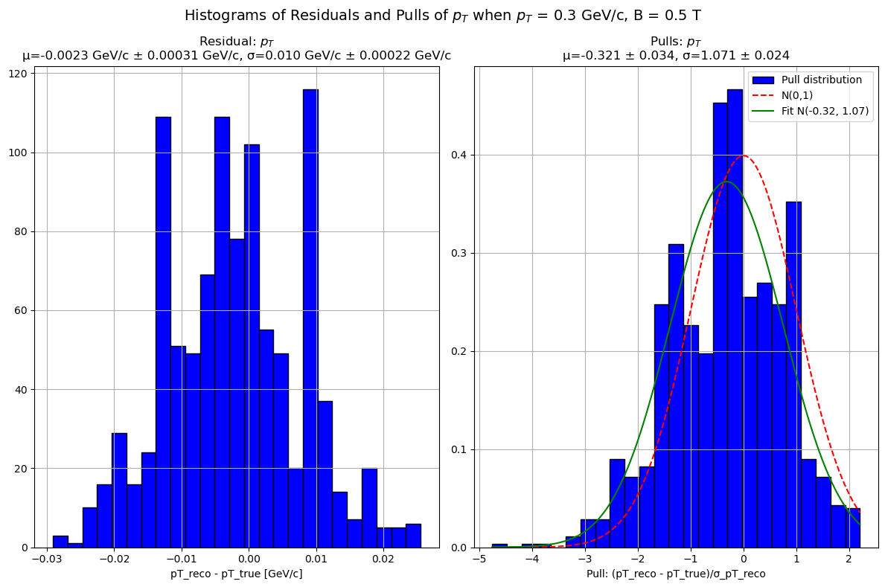

# Momentum Resolution of a Tracking Detector

Monte Carlo simulation and reconstruction of charged-particle trajectories in a
silicon-style tracking detector with a magnetic field, including a from-scratch
weighted least-squares fitter, bending-angle-based reconstruction of the transverse
momentum `pT`, and a full residual/pull analysis of the estimator and its uncertainties.



---

## Overview

A charged particle enters the detector at `(z = 0, x = x0)` with angle `s0` to the beam
axis, crosses five detection planes, is bent by a homogeneous magnetic field, and is
measured again by three further planes. From the eight discrete hit positions alone, the
task is to reconstruct the trajectory and the transverse momentum — and, more importantly,
to reconstruct honest uncertainties on them.

The project is structured in two parts:

| Part | Question | Method |
|------|----------|--------|
| **A — Tracking resolution** | How well can `x0` and `s0` be recovered from five discretised hits, with no field? | Weighted linear regression on the hit positions; residual and pull analysis over 1000 trajectories |
| **B — Momentum resolution** | How well can `pT` be recovered from the bending angle across the magnet? | Circular-arc propagation through the field, straight-line fits before and after, `pT` from the angular difference, with two alternative uncertainty models |

Everything is written in NumPy/SciPy; no tracking or fitting framework is used.

---

## Physics setup

- **Detector** — 5 planes before and 3 planes after the magnet, spaced `Δz = 2 cm`,
  measuring the `x` coordinate with cells of width `500 µm` and no sub-cell resolution.
  The hit is recorded at the cell centre with uncertainty `σ_x = cell width / √12`.
- **Magnet** — homogeneous field of length `L = 10 cm` between planes 5 and 6, oriented
  along `y`; `B ∈ {0.5, 1.0, 1.5, 2.0} T`.
- **Particles** — `x0 ~ N(0, 1 mm)`, `s0 ~ N(0, 0.1 rad)`, charge `q = ±1` assigned at
  random, `pT ∈ {0.1, 0.3, 1, 2, 5, 10, 20} GeV/c`.

Inside the field the particle follows a circular arc of radius `ρ = pT / (qB)`, so the
bending angle `θ ≈ L·q·B / pT` gives the reconstruction relation `pT ≈ L·q·B / θ`.

---

## Method notes

Three implementation decisions carry most of the work and are worth reading the code for:

**1. A hand-rolled weighted least-squares fitter instead of `curve_fit`.**
Fitting `x = x0 + tan(s0)·z` directly with `scipy.optimize.curve_fit` badly underestimated
the uncertainty on `s0`, because the nonlinearity of `tan` is not captured by the linearised
covariance estimate — the failure showed up as pull distributions with `σ` well above 1.
Reparametrising in terms of the slope reduced but did not eliminate the effect. The final
version implements weighted linear regression under a least-squares criterion directly
(`manual_least_squares`), which recovers correctly calibrated uncertainties at the cost of
runtime. **The pull distributions were used as the diagnostic that drove this iteration** —
they are the reason the first two approaches were rejected.

**2. Exact arc termination via root finding.**
The end of the circular arc was initially placed using the small-angle approximation
`θ ≈ L·q·B / pT`. Over many trajectories this truncated the most strongly deflected arcs too
early. The final version solves for the exit angle of each arc individually with
`scipy.optimize.root_scalar`, which makes the geometry correct for arbitrary numbers of
trajectories.

**3. Two uncertainty models for `pT`, switchable at call time.**
Naive Gaussian error propagation from the two fitted angles ignores their correlation and
underestimates `σ_pT`. A Monte Carlo alternative resamples both angles and takes the spread
of the reconstructed `pT` as the uncertainty; this improves the pull means but overestimates
`σ_pT` at high momentum. Both are implemented and selected via the `pt_calculation_way`
parameter, with the analytic version as default, so the trade-off stays visible rather than
being hidden behind one choice.

---

## Results

**Part A — tracking resolution (1000 trajectories, no field)**

Pull distributions are essentially ideal: `σ = 0.996 ± 0.022` for both `x0` and `s0`, with
means consistent with zero. The estimator is unbiased and its uncertainties are correctly
calibrated.



**Part B — momentum resolution (`pT = 0.3 GeV/c`, `B = 0.5 T`)**

Residual `σ = 0.010 GeV/c`, i.e. a relative resolution of roughly 3.3 %. The pull
distribution has `μ = -0.32`, `σ = 1.07`.



**Scaling behaviour.** Resolution improves with larger `B` and with smaller `pT`, both of
which shrink the radius of curvature `ρ = pT/(qB)` and therefore increase the measurable
deflection.

---

## Known limitations

Stated explicitly because they are the interesting part of the analysis:

1. **Negative pull bias in `pT`.** The reconstructed bending angle is systematically
   overestimated, so `pT` is systematically underestimated. With only three closely spaced
   planes after the magnet, the fitted slope is very sensitive to small `x` errors; because
   the slope enters through a division by the `z` lever arm, upward fluctuations produce
   larger deviations than downward ones, and the resulting asymmetry biases the angle.
   The effect grows with `B` and with extreme `pT`.
2. **Underestimated `σ_pT` at large `pT` and `B`.** The angles before and after the magnet
   are correlated, which the analytic propagation does not account for; the step-by-step
   geometric construction (centre → arc points → exit normal) compounds this.
3. **Discretisation artefacts.** At high `pT` the residual histograms break into distinct
   bands rather than approaching a Gaussian, an artefact of the finite cell width. Smaller
   cells would mitigate it.

---

## Repository contents

```
.
├── momentum_resolution.ipynb   # drives the simulation and presents the results
├── src/
│   └── tracking.py             # simulation, fitting and reconstruction functions
├── figures/                    # key figures, exported from the notebook
├── report/
│   ├── momentum_resolution_report.pdf   # full write-up with all results
│   └── midterm_presentation.pptx        # mid-course status presentation
├── requirements.txt
└── README.md
```

The simulation and reconstruction functions live in `src/tracking.py`; the notebook
imports them and drives the experiments.

The notebook is committed **with outputs**, so all figures and numbers render directly on
GitHub without re-running it.

---

## Running it

```bash
git clone https://github.com/florian-hellwig/particle_tracking.git
cd particle_tracking
python -m venv .venv && source .venv/bin/activate
pip install -r requirements.txt
jupyter lab momentum_resolution.ipynb
```

Python 3.10+. Then *Restart Kernel and Run All Cells*. The 1000-trajectory runs and the
per-arc root finding are the slow steps; reduce `nr_trajectories` in the setup cell for a
quick pass.

---

## Authors and contributions

Four-person course project, PHY 241 Data Analysis II, University of Zurich, spring 2025.
The report is submitted under all four names — Florian Hellwig, Felix Huber,
Mariano Fasano and Manuel Tuor.

Within the project:

- **Part A, tracking resolution:** Florian Hellwig, sole author — including the
  weighted least-squares fitter and the residual/pull analysis.
- **Part B, momentum resolution:** started by Mariano Fasano, developed further by
  Florian Hellwig, and completed jointly.
- **Report:** written by Florian Hellwig, with an early draft of one subsection
  contributed by Felix Huber.
